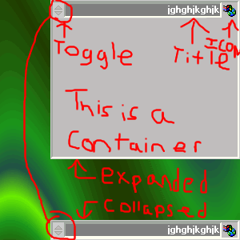



## Collapsable Toolbox Control \(like in Macromedia MX products\)

### Description

**UPDATED 7-31**

Now you can...

->Customize the toggle button

->Add a custom Icon

->Set the Titlebar Back Color

->Set the Titlebox BackColor

**END UPDATE**

A toolbox that is collapsable (see the screenshot) its pretty self explanatory, you can collapse/expand it programatically by calling the Collapse or Expand method. This conrol acts as a container too! Please vote for me if you like this control, I will update it as necessary. Please leave ANY comments that you have, and feel free to email me!
 
### More Info
 

             |
---                |---
**Submitted On**   |2002-07-31 09:12:52
**By**             |[Josh McCullough](https://github.com/Planet-Source-Code/PSCIndex/blob/master/ByAuthor/josh-mccullough.md)
**Level**          |Beginner
**User Rating**    |5.0 (10 globes from 2 users)
**Compatibility**  |VB 6\.0
**Category**       |[Custom Controls/ Forms/  Menus](https://github.com/Planet-Source-Code/PSCIndex/blob/master/ByCategory/custom-controls-forms-menus__1-4.md)
**World**          |[Visual Basic](https://github.com/Planet-Source-Code/PSCIndex/blob/master/ByWorld/visual-basic.md)
**Archive File**   |[Collapsabl1128537312002\.zip](https://github.com/Planet-Source-Code/josh-mccullough-collapsable-toolbox-control-like-in-macromedia-mx-products__1-37357/archive/master.zip)

